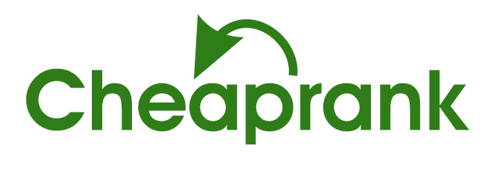

<!-- PROJECT LOGO -->
<br />
<p align="center">
  <a href="https://github.com/Oladimejidav/school-freelance-market">
    
  </a>

  <h3 align="center">School Market</h3>

  <p align="center">
    A kind of freelancing website for College
    <br />
    <a href="https://github.com/Oladimejidav/school-freelance-market"><strong>Explore the docs »</strong></a>
    <br />
</p>

<!-- ABOUT THE PROJECT -->

## About The Project

A kind of freelancing website for College. Where Lecturer can publish his/her project here waiting students apply to work on the project. Student will get some kind of rewards like salary and/or certification.

Features:

-   Commons
    -   Explore Project
    -   Leaderboard
    -   Profile
    -   Message
    -   Inbox
-   Lecturer
    -   Project Publications (Posting - Recruit - Review)
    -   Project Box (to Organize Project)
    -   Hire Student
-   Student
    -   Apply Project (as Individual / as Team)
    -   Party (for make the Team)
    -   Project Box (to See current Apply/Ongoing/Finished projects)
    -   Wishlist Project
-   Experiment
    -   Adaptive while being Responsive (Mobile version is Mobile Apps-like)

### Built With

-   [Laravel](https://laravel.com/)
-   [VueJS](https://vuejs.org/)
-   [Sass](https://sass-lang.com/)

<!-- GETTING STARTED -->

## Getting Started

To get a local copy up and running follow these simple steps.

### Prerequisites

-   [npm](https://nodejs.org/)
-   [composer](https://getcomposer.org/download/)
-   AMP stack
    -   Apache HTTP Server
    -   MySQL
    -   [PHP](https://www.php.net/downloads)

### Installation

1. Clone the repo
    ```sh
    git clone https://github.com/oladimejidav/phive.git
    ```
2. Get into the project
    ```sh
    cd phive
    ```
3. Install the frontend packages (NPM)
    ```sh
    npm install
    ```
4. Install the backend packages
    ```sh
    composer install
    ```

<!-- USAGE EXAMPLES -->

## Usage

1. Make `.env` file by copy the `.env.example`
    ```sh
    cp .env.example .env
    ```
2. Edit `.env` file to setup database connection
    ```dosini
    DB_DATABASE=db_name
    DB_USERNAME=user_to_access_the_db
    DB_PASSWORD=user_password
    ```
3. Set application key
    ```sh
    php artisan key:generate
    ```
4. Create tables using migration with dummy data
    ```sh
    php artisan migrate:fresh --seed
    ```
5. Create the frontend production ready files
    ```sh
    npm run prod
    ```
6. Run the app
    ```sh
    php artisan serve
    ```
7. Try dummy account

    ```dosini
    # student
    username = student@example.com
    password = password

    # lecturer
    username = lecturer@example.ac.id
    password = password
    ```

<!-- CONTRIBUTING -->

## Contributing

Contributions are what make the open source community such an amazing place to be learn, inspire, and create. Any contributions you make are **greatly appreciated**.

1. Fork the Project
2. Create your Feature Branch (`git checkout -b feature/AmazingFeature`)
3. Commit your Changes (`git commit -m 'Add some AmazingFeature'`)
4. Push to the Branch (`git push origin feature/AmazingFeature`)
5. Open a Pull Request

<!-- LICENSE -->

## License

Distributed under the MIT License. See `LICENSE` for more information.

<!-- CONTACT -->

## Contact

Project Link: [https://github.com/Oladimejidav/school-freelance-market](https://github.com/Oladimejidav/school-freelance-market)

<!-- ACKNOWLEDGEMENTS -->

## Acknowledgements

-   [Laravel-Vue SPA starter kit](https://github.com/cretueusebiu/laravel-vue-spa)

<!-- MARKDOWN LINKS & IMAGES -->
[linkedin-url]: https://linkedin.com/in/david-ogunye
